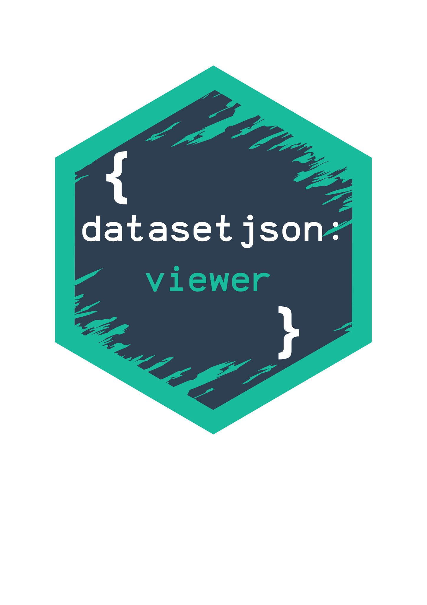

# JSON Dataset Viewer    

A powerful and user-friendly Shiny application for exploring and analyzing JSON datasets with interactive features and comprehensive data visualization capabilities.

## 🚀 Features

### Upload & Management

-   Support for JSON and NDJSON file formats
-   Multiple file upload capability
-   Automatic metadata display
-   File management system

### Data Exploration

-   Interactive data viewer with dynamic filtering
-   Advanced sorting capabilities
-   Column management (hide/show, sticky columns)
-   Row highlighting functionality

### Variable Analysis

-   Smart variable browser with automatic visualization
-   Grouping capabilities for deeper insights
-   Interactive outputs based on variable types
-   Statistical summaries and distributions

## 🛠️ Getting Started

### Prerequisites

[Installation requirements will go here]

### Installation

[Installation steps will go here]

## 📖 User Guide

### File Upload Process

1.  Select JSON/NDJSON files through the browser
2.  Wait for complete upload (files appear in list)
3.  View metadata in the right panel
4.  Access the Viewer Panel once data is loaded

The JSON Dataset Viewer allows you to select json and ndjson files from a browser. You should be able to only select those supported extensions to avoid errors. Once the selected files are uploaded you are able to see the list of them in the card below, as well as the metadata behind it on the right side. You should only see the Viewer Panel appear when the data is fully loaded. Click on "Remove All Files" button to clear the list, this is basically reloading the session. It is not possible yet to delete one specific dataset from the list. Navigate across the radio buttons to see metadata from the different json files.

> ⚠️ **Important:** Be patient with large files and ensure complete upload before switching panels.

### Data Viewer Features

#### Viewer Tool

The Viewer Tool consists of three main panels:

1.  **Data Manipulation Panel**
    -   File selection
    -   R syntax filtering
    -   Download filtered data -**ONLY DATA FILTERED BY R SYNTAX**-
2.  **Variable Browser**
    -   Automatic visualization based on variable type
    -   Grouping functionality
    -   Interactive data exploration
3.  **Information Panel**
    -   Usage tips
    -   Filtering guidelines

#### 📝 Filtering Tips

For successful filtering operations:

| Operation | Syntax Example             |
|-----------|----------------------------|
| Equality  | `VAR == "Value"`           |
| AND       | `condition1 && condition2` |
| OR        | `condition1 || condition2` |
| NOT       | `!condition`               |
| Numeric   | `VARNUM < 78`              |

> 🔍 Remember to match variable names exactly and use double quotes for text values!

### Variable Browser Features

The Variable Browser automatically adapts to your data:

-   **Categorical Variables:** Distribution tables
-   **Numeric Variables:** Statistical visualizations
-   **Grouping Options:** Multi-variable analysis

## Known Limitations

-   Bulk file removal only (individual file deletion coming soon)
-   Case-sensitive filtering system
-   Performance depends on environment capabilities

## 👥 Authors

-   **Sebastià Barceló**
-   **Hugo Signol**

## 📄 License

[License information will go here]

------------------------------------------------------------------------

For more information or to report issues, please visit our GitHub repository.
